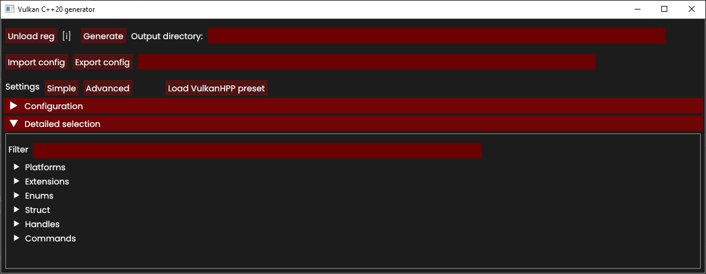

# Vulkan C++ API generator

⚠️ **Work in progress! Use at your own risk**

Generates C++20 Vulkan API bindings. 

Official C++ bindings: <https://github.com/KhronosGroup/Vulkan-Hpp>.\
Main purpose of this project is to introduce more lightweight   
bindings resulting in faster compilation speed.

Configurable via GUI for experimental purposes.

## Requirements

* C++20 compatible compiler
* Vulkan SDK <https://www.lunarg.com/vulkan-sdk/>
* CMake <https://cmake.org/>

## Environment

Tested on windows 10 & clang 16.

## License
Licensed under the MIT License.

    https://opensource.org/licenses/MIT